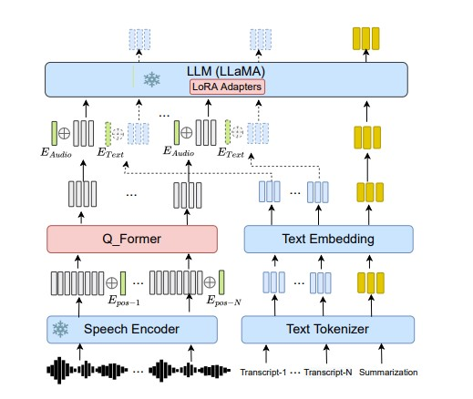

# SSummarize (end to end speech to text summarization)
- Abstractive Speech Summarization (SSummarize) aims to generate human-like text summaries from spoken 
  content.end-to-end SSum model that utilizes Q-Former as a connector for the audio-text modality and employs LLMs to generate text summaries directly from speech features.

## research paper : https://arxiv.org/html/2407.02005v1

## Dataset
  -  can download from https://www.kaggle.com/datasets/nfedorov/audio-summarization/data

